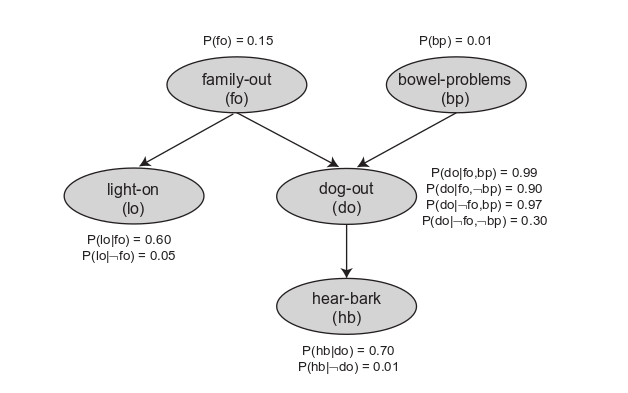

<!-- setup Julia environmental and JS Code -->
```{r, child = "../header.Rmd"}
```

```{r}
# Do not evaluate any code. This needs to be removed!
knitr::opts_chunk$set(eval = FALSE)
```

Objectives:

* Review of the concept of hierarchical statistical models.
* Become familiar with the software `JAGS`  to do Bayesian inference for parameters and states of potentially hierarchical models using Gibbs sampling.
* Do inference for the simple, didactical, hierarchical probability network model presented in Charniak, E. Bayesian networks without tears. AI Magazine, 12(4):50-63. 1991.
* Optional: Become familiar with the software `Stan`  for inference of hierarchical models with continuous parameters based on Hamiltonian Markov Chain Monte Carlo sampling

Prerequisites:

* `JAGS` must be installed independently of R before use with `rjags` from <http://mcmc-jags.sourceforge.net/>.
* Required packages: `rjags`, `coda`; for optional exercise `rstan` (you may have to add the line `CXX14 = g++ -std=c++1y` to the file `My Documents\.R\Makevars.win` to get the command `stan` from `rstan` running).


# Hierarchical Statistical Models

The joint probability distribution of a probabilistic model graphically represented by a directed, acyclic graph can be formulated as the product of the marginal (prior) distributions of all nodes without parents and the conditional distributions of all child nodes given their parents.



For the simple probability network by Charniak et al. (1991), this leads to the following joint probability distribution of all nodes:

$$P(fo,bp,lo,do,hb) = P(fo) \cdot P(bp) \cdot P(lo \mid fo) \cdot P(do \mid fo,bp) \cdot P(hb \mid do)$$

The posterior distribution of unknown nodes given observed nodes is proportional to this joint distribution with the observations substituted for the observed nodes:

$$P(fo,bp,do \mid lo,hb) \propto P(fo) \cdot P(bp) \cdot P(lo \mid fo) \cdot P(do \mid fo,bp) \cdot P(hb \mid do)$$

Gibbs sampling, Metropolis sampling or Metropolis-Hastings sampling of posteriors of all unknown nodes conditioned on observed nodes can then easily be implemented.

Probabilistic programming languages allow their users to formulate there models by defining the factors as shown in the example above.
This makes them easy to use.

In `JAGS`, this is done by 'sampling statements' of the form `variable ~ distribution(parameters)` for all nodes.
As for the factors in the expression above, the order of these statements does not matter.
Additional statements can be added to calculate distribution parameters.
`JAGS` automatically detects from the data provided which variables are observed and which ones have to be inferred.
`JAGS` then does Gibbs sampling from the conditional distributions.

`Stan` uses a similar syntax but builds the log of the joint probability density by adding the log of the corresponding probability density for each sampling statement.
The log of the joint density is then used for Hamiltonian Markov Chain Monte Carlo sampling of the posterior.
The first initialization of a new model is much slower in `Stan` relative to `JAGS` as the posterior and its derivatives is translated into `C++` code, compiled and then executed.
This makes `Stan` less convenient for small, didactical models.
However, for larger models, the higher initialization effort in `Stan` is by far compensated by the much more efficient sampling process based on Hamiltonian Monte Carlo.
Also, if the model is not changed, the previously compiled code is re-used which significantly accelerates initialization.


# Inference with "rjags" for the Model "monod"

Load the coda and rjags packages:
```{r message=FALSE}
library(rjags)
library(coda)
```

Define global variables for file name, sample size, and plot line resolution:
```{r}

# Define global variables:
file.jags.model.4.1 <- "exercise_4_1.jags"
sampsize <- 10000
nout     <- 101

```

Read and plot the data:
```{r}

# Read data for model "monod":
data.monod <- read.table("model_monod.dat",header=T)

# Plot data:
plot(data.monod)
```

Create JAGS model definition file by calculating parameters and writing 'sampling statements' for all prior and conditional distributions (this file could also be created using any text editor).

Note 1: The means and standard deviations, `mu` and `sd`, of the lognormal distributions have to be converted to the corresponding parameters, `mulog` and `sdlog`, of the normal distribution that generates the lognormal distribution by exponentiation).

Note 2: `JAGS` is using the precision (inverse variance), `1/sd^2`, rather than the standard deviation, `sd`, to parameterize normal and lognormal distributions.
```{r}

# Write model definition file for model "monod":
cat("model {\n",
    # parameter conversions for lognormal distributions:
    "  sdlog_rmax <- sqrt(log(1+sd_r_max^2/mu_r_max^2))\n",
    "  mulog_rmax <- log(mu_r_max)-0.5*sdlog_rmax^2\n",
    "  sdlog_K    <- sqrt(log(1+sd_K^2/mu_K^2))\n",
    "  mulog_K    <- log(mu_K)-0.5*sdlog_K^2\n",
    "  sdlog_sd_r <- sqrt(log(1+sd_sd_r^2/mu_sd_r^2))\n",
    "  mulog_sd_r <- log(mu_sd_r)-0.5*sdlog_sd_r^2\n",
    # priors of model parameters:
    "  r_max  ~ dlnorm(mulog_rmax,1/sdlog_rmax^2)\n",
    "  K      ~ dlnorm(mulog_K,1/sdlog_K^2)\n",
    "  sd_r   ~ dlnorm(mulog_sd_r,1/sdlog_sd_r^2)\n",
    # model of observables given parameters (likelihood):
    "  for ( i in 1:n ) {\n",
    "    rhat[i] <- r_max*C[i]/(K+C[i])\n",
    "    r[i] ~ dnorm(rhat[i],1/sd_r^2)\n",
    "  }\n",
    "}\n",
    sep="",
    file=file.jags.model.4.1)

```

Initialize the `JAGS` model and sample from the posterior of the model parameters given the data:
```{r}
# Initialize JAGS model:
jags.obj <- jags.model(file.jags.model.4.1,
                       data=list(mu_r_max = 5,
                                 mu_K     = 3,
                                 mu_sd_r  = 1,
                                 sd_r_max = 2.5,
                                 sd_K     = 1.5,
                                 sd_sd_r  = 0.5,
                                 n        = nrow(data.monod),
                                 C        = data.monod$C,
                                 r        = data.monod$data))

# Sample from posterior of JAGS model:
jags.res <- coda.samples(jags.obj,c("r_max","K","sd_r"),sampsize)

```

Plot traces of Markov chains and marginal densities of parameters:
```{r monod_traces_densities_jags,fig.height=7,fig.width=7,cache=TRUE}

# Plot marginal posteriors:
plot(jags.res)

```

Plot model predictions and data (median prediction, 95% credibility interval of knowledge of 'TRUE' solution, 95% credibility interval of potential new observations [including observation error]):
```{r monod_predictions_data_jags,fig.height=4,fig.width=5,cache=TRUE}

# Plot model predictions
# Plot data:
plot(data.monod$C, data.monod$data, main="Data: monod",xlab="C", ylab="r", pch=19,
     xaxs="i",yaxs="i",xlim=c(0,1.05*max(data.monod$C)),ylim=c(0,1.05*max(data.monod$data)))
# Plot quantiles of model prediction without observation error:
C <- 1.05*max(data.monod$C)*0:(nout-1)/(nout-1)
r <- matrix(NA,ncol=nout,nrow=sampsize)
for ( i in 1:nout ) r[,i] <- jags.res[[1]][,"r_max"]*C[i]/(jags.res[[1]][,"K"]+C[i])
r.quant <- apply(r,2,quantile,probs=c(0.05,0.5,0.95))
for ( j in 1:nrow(r.quant) ) lines(C,r.quant[j,],lty=c("dashed","solid","dashed")[j])
# Plot quantiles of model prediction with observation error:
for ( i in 1:nrow(r) ) r[i,] <- r[i,] + rnorm(nout,0,jags.res[[1]][i,"sd_r"])
r.quant <- apply(r,2,quantile,probs=c(0.05,0.95))
for ( j in 1:nrow(r.quant) ) lines(C,r.quant[j,],lty="dotted")

```


# 1. Inference with "rjags" for the Model "survival"

Load the coda and rjags packages:
```{r}

# Load packages:
if ( !require("coda") )  { install.packages("coda");  library(coda)  }
if ( !require("rjags") ) { install.packages("rjags"); library(rjags) }

```

Define global variables for file names and sample size:
```{r}

# Define global variables:
file.jags.model.4.2a  <- "exercise_4_2a.jags"
file.jags.model.4.2b  <- "exercise_4_2a.jags"
sampsize <- 10000

```

Read and plot the data:
```{r survival_data_again,fig.height=4,fig.width=5,cache=TRUE}

# Read data of model "survival"
data.survival <- read.table("model_survival.dat",header=T)  # read as data frame

# Plot data:
y <- c(data.survival$data,30-sum(data.survival$data))
t <- c(0,data.survival$t,1000000)
names(y) <- c(data.survival$t,paste(">",max(data.survival$t)))
barplot(y,main="Data: survival",xlab="t",ylab="deaths")

```

Create JAGS model definition file for numbers of deaths in each time interval by calculating parameters and writing 'sampling statements' for all prior and conditional distributions (this file could also be created using any text editor).

Note 1: The means and standard deviations, `mu` and `sd`, of the lognormal distributions have to be converted to the corresponding parameters, `mulog` and `sdlog`, of the normal distribution that generates the lognormal distribution by exponentiation).

Note 2: `JAGS` is using the precision (inverse variance), `1/sd^2`, rather than the standard deviation, `sd`, to parameterize normal and lognormal distributions.
```{r}

# Write JAGS definition of model "survival" based on num. of deaths in time intervals
cat("model {\n",
    "  sdlog_lambda <- sqrt(log(1+sd_lambda^2/mu_lambda^2))\n",
    "  mulog_lambda <- log(mu_lambda)-0.5*sdlog_lambda^2\n",
    "  lambda ~ dlnorm(mulog_lambda,1/sdlog_lambda^2)\n",
    "  for ( i in 1:n ) {\n",
    "    p[i] <- exp(-lambda*t[i])-exp(-lambda*t[i+1])\n",
    "  }\n",
    "  y ~ dmulti(p,N)\n",
    "}\n",
    sep="",
    file=file.jags.model.4.2a)

```

Initialize JAGS model and sample from the posterior of the model parameters given the data:
```{r eval=FALSE}

# Initialize JAGS model:
jags.obj <- jags.model(file.jags.model.4.2a,
                       data=list(mu_lambda = 0.2,
                                 sd_lambda = 0.2,
                                 n         = length(y),
                                 N         = sum(y),
                                 t         = t,
                                 y         = y))

# Sample from posterior of JAGS model:
jags.res <- coda.samples(jags.obj,c("lambda"),sampsize)

```

Plot traces of Markov chains and marginal densities of parameters:
```{r survival_traces_densities_jags,fig.height=4,fig.width=7,cache=TRUE}

# Plot marginals of posterior:
plot(jags.res)

```

Alternative model formulation for number of surviving organisms instead of number of deaths in each time interval.

Define and plot modified variables and data:
```{r survival_modified_data,fig.height=4,fig.width=5,cache=TRUE}

# Define variables for model "survival" based on number of survivors at given times:
y <- c(30,rep(NA,length(data.survival$data)))
for ( i in 1:length(data.survival$data) ) y[i+1] <- y[i] - data.survival$data[i]
t <- c(0,data.survival$t)
names(y) <- t

# Plot data:
barplot(y,main="Data: survival",xlab="t",ylab="survivers")

```

Create JAGS model definition file for numbers of surviving individuals after each time interval by calculating parameters and writing 'sampling statements' for all prior and conditional distributions (this file could also be created using any text editor).

Note 1: The means and standard deviations, `mu` and `sd`, of the lognormal distributions have to be converted to the corresponding parameters, `mulog` and `sdlog`, of the normal distribution that generates the lognormal distribution by exponentiation).

Note 2: `JAGS` is using the precision (inverse variance), `1/sd^2`, rather than the standard deviation, `sd`, to parameterize normal and lognormal distributions.
```{r}

# Write JAGS definition for model "survival" for number of survivors at given times:
cat("model {\n",
    "  sdlog_lambda <- sqrt(log(1+sd_lambda^2/mu_lambda^2))\n",
    "  mulog_lambda <- log(mu_lambda)-0.5*sdlog_lambda^2\n",
    "  lambda ~ dlnorm(mulog_lambda,1/sdlog_lambda^2)\n",
    "  for ( i in 2:n ) {\n",
    "    y[i] ~ dbinom(exp(-lambda*(t[i]-t[i-1])),y[i-1])\n",
    "  }\n",
    "}\n",
    sep="",
    file=file.jags.model.4.2b)

```

Initialize JAGS model and sample from the posterior of the model parameters given the data:
```{r}

# Initialize JAGS model:
jags.obj <- jags.model(file.jags.model.4.2b,
                       data=list(mu_lambda = 0.2,
                                 sd_lambda = 0.2,
                                 n         = length(y),
                                 t         = t,
                                 y         = y))

# Sample from posterior of JAGS model:
jags.res <- coda.samples(jags.obj,c("lambda"),sampsize)

```

Plot traces of Markov chains and marginal densities of parameters:
```{r survival_modified_traces_densities,fig.height=4,fig.width=7,cache=TRUE}

# Plot results:
plot(jags.res)

```


# 2. Inference with "rjags" for the Model "charniak"

Load the coda and rjags packages:
```{r}

# Load packages:
if ( !require("coda") )  { install.packages("coda");  library(coda)  }
if ( !require("rjags") ) { install.packages("rjags"); library(rjags) }

```

Define global variables for file name and sample size:
```{r}

# Define globel variables:
file.jags.model.4.3 <- "exercise_4_3.jags"
sampsize <- 10000

```

Create JAGS model definition file by writing 'sampling statements' for all prior and conditional distributions (this file could also be created using any text editor).

Note: The formulation of hierarchical models is straightforward: 'sampling nodes' can be uase as parameters in other 'sampling statements'.
```{r}

# Write JAGS definition of model "charniak":
cat("model {\n",
    "  p_lo <- 0.60*fo + 0.05*(1-fo)\n",
    "  p_do <- 0.99*fo*bp + 0.90*fo*(1-bp) + 0.97*(1-fo)*bp + 0.30*(1-fo)*(1-bp)\n",
    "  p_hb <- 0.70*do + 0.01*(1-do)\n",
    "  fo ~ dbern(0.15)\n",
    "  bp ~ dbern(0.01)\n",
    "  lo ~ dbern(p_lo)\n",
    "  do ~ dbern(p_do)\n",
    "  hb ~ dbern(p_hb)\n",
    "}\n",
    sep="",
    file=file.jags.model.4.3)

```

Initialize JAGS model and sample from the posterior of the model parameters given the data:
```{r}

# Initialize JAGS model:
jags.obj <- jags.model(file.jags.model.4.3,data=list(lo=1,hb=0))

# Sample from JAGS model:
jags.res <- coda.samples(jags.obj,c("fo","bp","lo","do","hb"),sampsize)

```

Extract and print results:
```{r}

# List results for model "charniak":
print(summary(jags.res))

```


# 3. Inference with "rstan" for the Model "monod"

Load the coda and rstan packages and set options for using (in this case all) multiple cores in parallel for multiple chains:
```{r message=FALSE}

# Load packages and initialize number of cores to be used:
if ( !require("coda") )  { install.packages("coda");  library(coda)  }
if ( !require("rstan") ) { install.packages("rstan"); library(rstan) }
rstan_options(auto_write = TRUE)
options(mc.cores = parallel::detectCores())

```

Define global variables for file name, sample size, and plot line resolution:
```{r}

# Define global variables:
file.stan.model.4.4.1 <- "exercise_4_4_1.stan"
sampsize <- 10000
nout     <- 101

```

Read and plot the data:
```{r monod_data_again,fig.height=4,fig.width=5,cache=TRUE}

# Read data of model "monod":
data.monod <- read.table("model_monod.dat",header=T)

# Plot data of model "monod":
plot(data.monod$C,data.monod$data,main="Data: monod",xlab="C",ylab="r",pch=19,
     xaxs="i",yaxs="i",xlim=c(0,1.05*max(data.monod$C)),ylim=c(0,1.05*max(data.monod$data)))

```


Create Stan model definition file by calculating parameters and writing 'sampling statements' for all prior and conditional distributions (this file could also be created using any text editor):

Note 1: `Stan` requires the explicit declaration of variables and parameters.

Note 2: The means and standard deviations, `mu` and `sd`, of the lognormal distributions have to be converted to the corresponding parameters, `mulog` and `sdlog`, of the normal distribution that generates the lognormal distribution by exponentiation).

Note 3: In contrast to `JAGS`, `Stan` used the standard deviation, `sd`, to parameterize the normal and lognormal distributions.
```{r}

# Write Stan definition of model "monod":
cat("data {\n",
    "  real mu_r_max;\n",
    "  real sd_r_max;\n",
    "  real mu_K;\n",
    "  real sd_K;\n",
    "  real mu_sd_r;\n",
    "  real sd_sd_r;\n",
    "  int n;\n",
    "  real C[n];\n",
    "  real r[n];\n",
    "}\n",
    "parameters {\n",
    "  real<lower=0> r_max;\n",
    "  real<lower=0> K;\n",
    "  real<lower=0> sd_r;\n",
    "}\n",
    "model {\n",
    "  real mulog_rmax;\n",
    "  real sdlog_rmax;\n",
    "  real mulog_K;\n",
    "  real sdlog_K;\n",
    "  real mulog_sd_r;\n",
    "  real sdlog_sd_r;\n",
    "  real rhat[n];\n",
    "  sdlog_rmax = sqrt(log(1+sd_r_max^2/mu_r_max^2));\n",
    "  mulog_rmax = log(mu_r_max)-0.5*sdlog_rmax^2;\n",
    "  sdlog_K    = sqrt(log(1+sd_K^2/mu_K^2));\n",
    "  mulog_K    = log(mu_K)-0.5*sdlog_K^2;\n",
    "  sdlog_sd_r = sqrt(log(1+sd_sd_r^2/mu_sd_r^2));\n",
    "  mulog_sd_r = log(mu_sd_r)-0.5*sdlog_sd_r^2;\n",
    "  r_max ~ lognormal(mulog_rmax,sdlog_rmax);\n",
    "  K     ~ lognormal(mulog_K,sdlog_K);\n",
    "  sd_r  ~ lognormal(mulog_sd_r,sdlog_sd_r);\n",
    "  for ( i in 1:n ) {\n",
    "    rhat[i] = r_max*C[i]/(K+C[i]);\n",
    "    r[i] ~ normal(rhat[i],sd_r);\n",
    "  }\n",
    "}\n",
    sep="",
    file=file.stan.model.4.4.1)

```

Run inference with the Stan model:
```{r}

# Sample from model "monod":
stan.res1 <- stan(file.stan.model.4.4.1,
                  data=list(mu_r_max = 5,
                            mu_K     = 3,
                            mu_sd_r  = 1,
                            sd_r_max = 2.5,
                            sd_K     = 1.5,
                            sd_sd_r  = 0.5,
                            n        = nrow(data.monod),
                            C        = data.monod$C,
                            r        = data.monod$data),
                  iter=sampsize,
                  chains=4)

```

Extract and plot results.

Note: `Stan` by default adds a trace (the density can be ignored) for the log posterior (variable `lp__`). This is very convenient for convergence checks.

```{r monod_stan,fig.height=9,fig.width=7,cache=TRUE}

# Extract results of model "monod":
stan.res.sample1 <- as.array(stan.res1)
stan.res.mcmc1   <- As.mcmc.list(stan.res1)

# Plot results:
plot(stan.res.mcmc1)

```


# 4. Inference with "rstan" for the Model "survival"

Load the coda and rstan packages:

```{r}

# Load packages and initialize number of cores to be used:
if ( !require("coda") )  { install.packages("coda");  library(coda)  }
if ( !require("rstan") ) { install.packages("rstan"); library(rstan) }
rstan_options(auto_write = TRUE)
options(mc.cores = parallel::detectCores())

```

Define global variables for file name, sample size, and plot line resolution:
```{r}

# Define global variables:
file.stan.model.4.4.2  <- "exercise_4_4_2.stan"
sampsize <- 10000
nout     <- 101

```

Read and plot the data:
```{r survival_data,fig.height=4,fig.width=5,cache=TRUE}

# Read data of model "survival":
data.survival <- read.table("model_survival.dat",header=T)  # read as data frame

# Plot data of model "survival":
y <- c(data.survival$data,30-sum(data.survival$data))
t <- c(0,data.survival$t,1000000)
names(y) <- c(data.survival$t,paste(">",max(data.survival$t)))
barplot(y,main="Data: survival",xlab="t",ylab="deaths")

```

Create Stan model definition file by calculating parameters and writing 'sampling statements' for all prior and conditional distributions (this file could also be created using any text editor):

Note 1: `Stan` requires the explicit declaration of variables and parameters.

Note 2: The means and standard deviations, `mu` and `sd`, of the lognormal distributions have to be converted to the corresponding parameters, `mulog` and `sdlog`, of the normal distribution that generates the lognormal distribution by exponentiation).

Note 3: In contrast to `JAGS`, `Stan` used the standard deviation, `sd`, to parameterize the normal and lognormal distributions.

```{r}

# Write Stan definition of model "survival":
cat("data {\n",
    "  real mu_lambda;\n",
    "  real sd_lambda;\n",
    "  int n;\n",
    "  real t[n+1];\n",
    "  int  y[n];\n",
    "}\n",
    "parameters {\n",
    "  real<lower=0> lambda;\n",
    "}\n",
    "model {\n",
    "  real      mulog_lambda;\n",
    "  real      sdlog_lambda;\n",
    "  vector[n] p;\n",
    "  sdlog_lambda = sqrt(log(1+sd_lambda^2/mu_lambda^2));\n",
    "  mulog_lambda = log(mu_lambda)-0.5*sdlog_lambda^2;\n",
    "  lambda ~ lognormal(mulog_lambda,sdlog_lambda);\n",
    "  for ( i in 1:n ) {\n",
    "    p[i] = exp(-lambda*t[i])-exp(-lambda*t[i+1]);\n",
    "  }\n",
    "  y ~ multinomial(p);\n",
    "}\n",
    sep="",
    file=file.stan.model.4.4.2)

```

Run inference with the Stan model:

```{r}

# Sample from posterior of model "survival"
stan.res2 <- stan(file.stan.model.4.4.2,
                  data=list(mu_lambda = 0.2,
                            sd_lambda = 0.2,
                            n         = nrow(data.survival)+1,
                            N         = sum(y),
                            t         = t,
                            y         = y),
                  iter=sampsize,
                  chains=4)

```

Extract and plot results.

Note: `Stan` by default adds a trace (the density can be ignored) for the log posterior (variable `lp__`). This is very convenient for convergence checks.

```{r survival_stan,fig.height=6,fig.width=7,cache=TRUE}

# Extract results of model "survival":
stan.res.sample2 <- as.array(stan.res2)
stan.res.mcmc2   <- As.mcmc.list(stan.res2)

# Plot results:
plot(stan.res.mcmc2)

```
